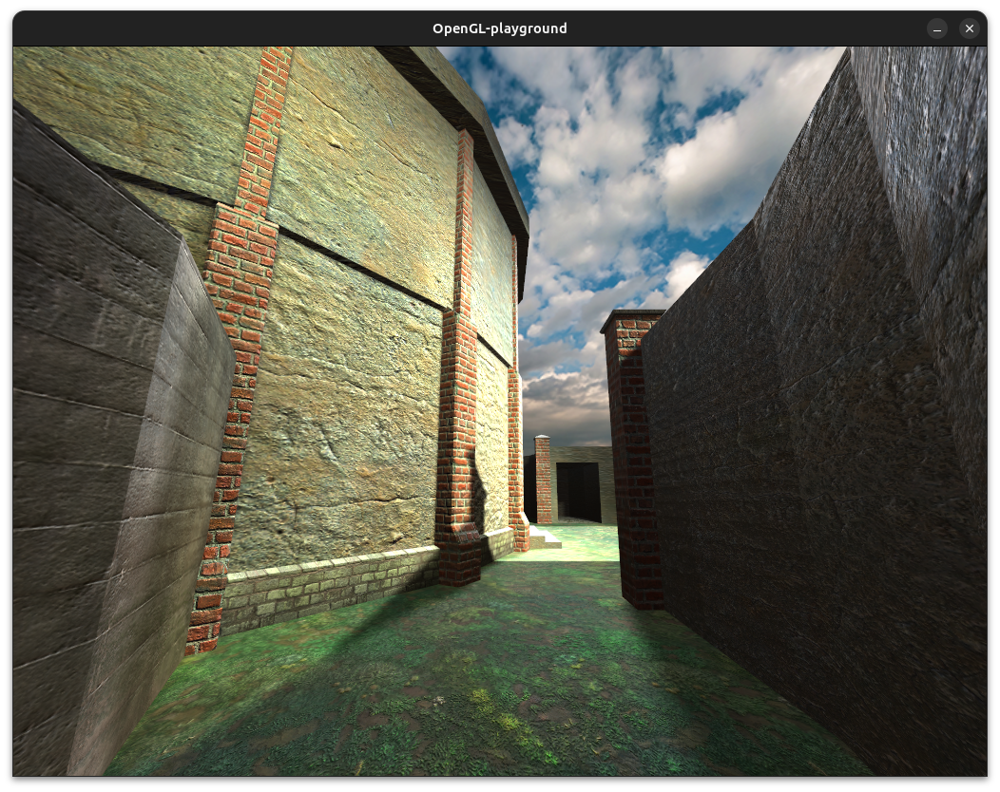
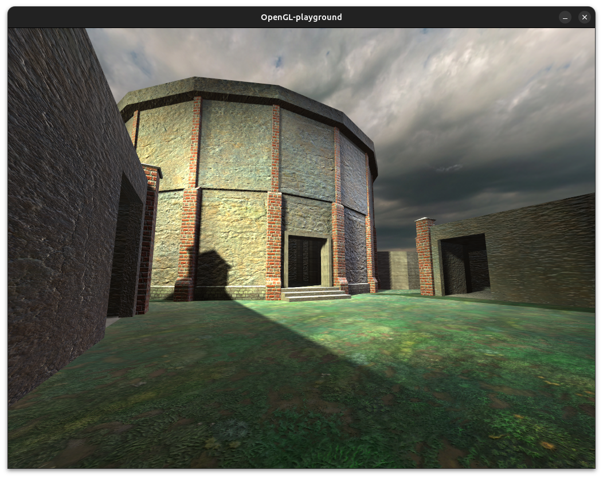
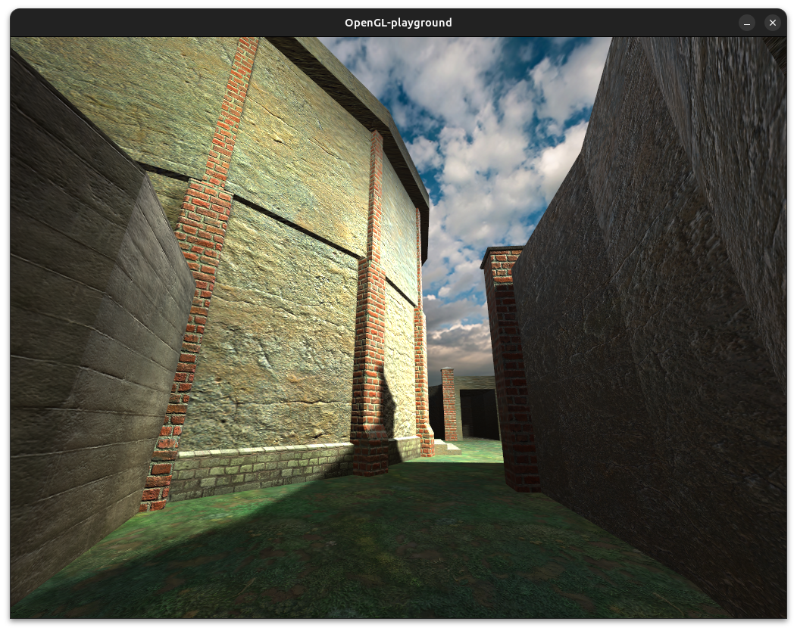
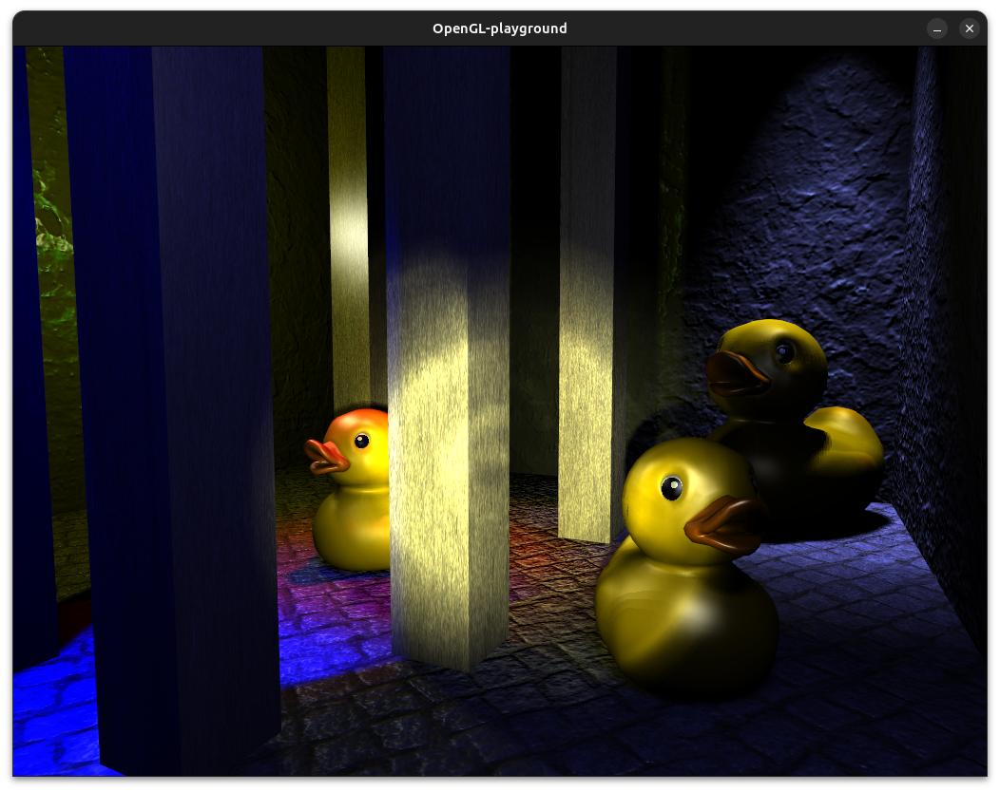
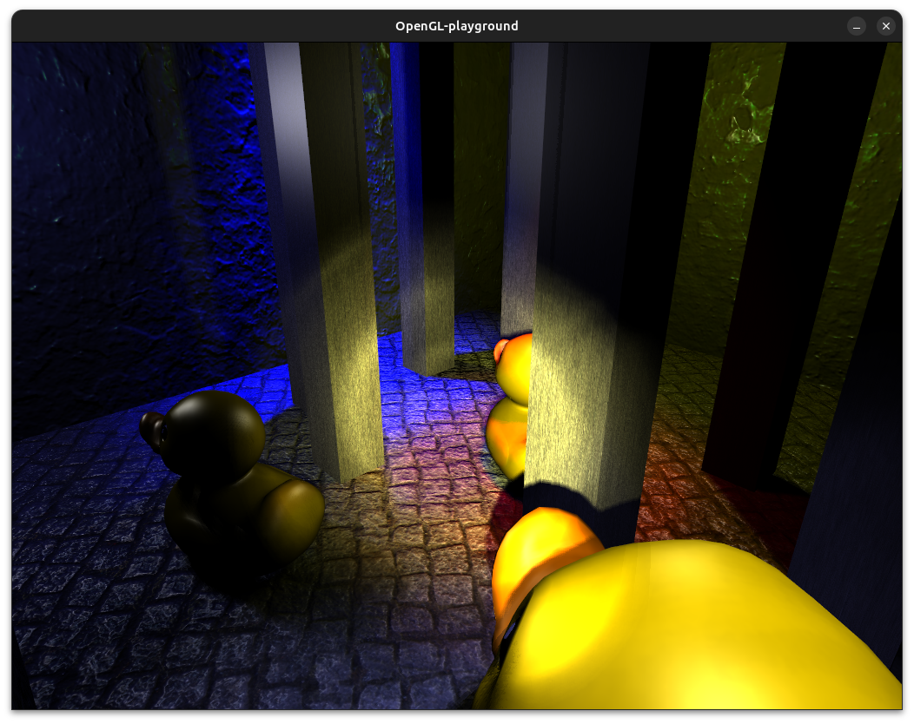
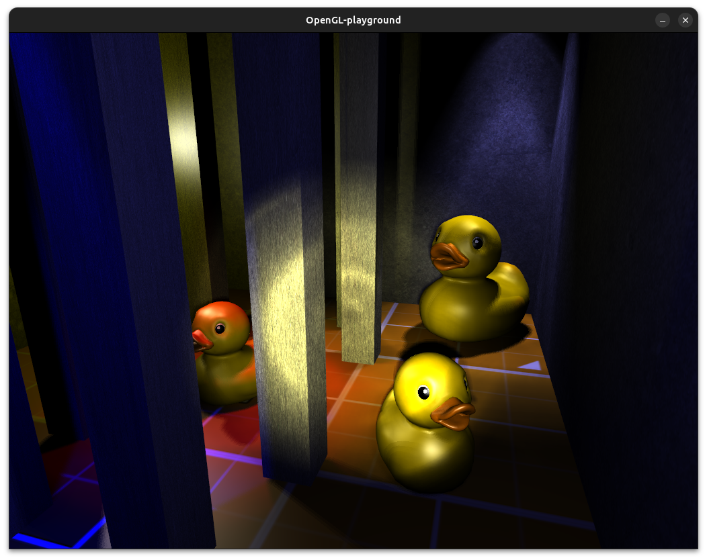
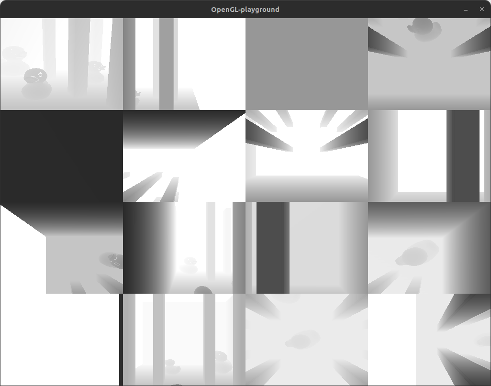
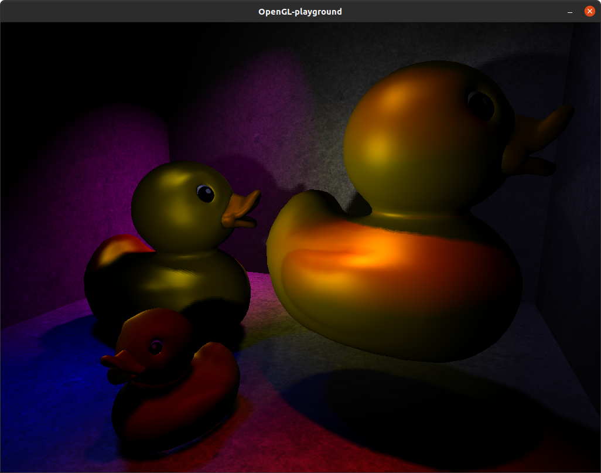

## Playing around with various OpenGL rendering techniques.

Dependencies for Linux

`libglm-dev`
`libsdl2-2.0-0`
`libsdl2-dev`
`libglew-dev`

History

-   Fix for the texture atlas seams and mip-mapping and various other improvements.

    

      
        
            
    

-   Normal mapping and basic specular maps.

    

      
            
    

-   Multiple point and spot lights casting shadows. Light projection texture. Texture atlases.

    

      
      
    

-   Multiple spot lights casting shadows.

    

      
    

-   Multiple point and spot lights with shadow cast from one of the spot lights. Shadow has PCF filtering.

    

      
    

